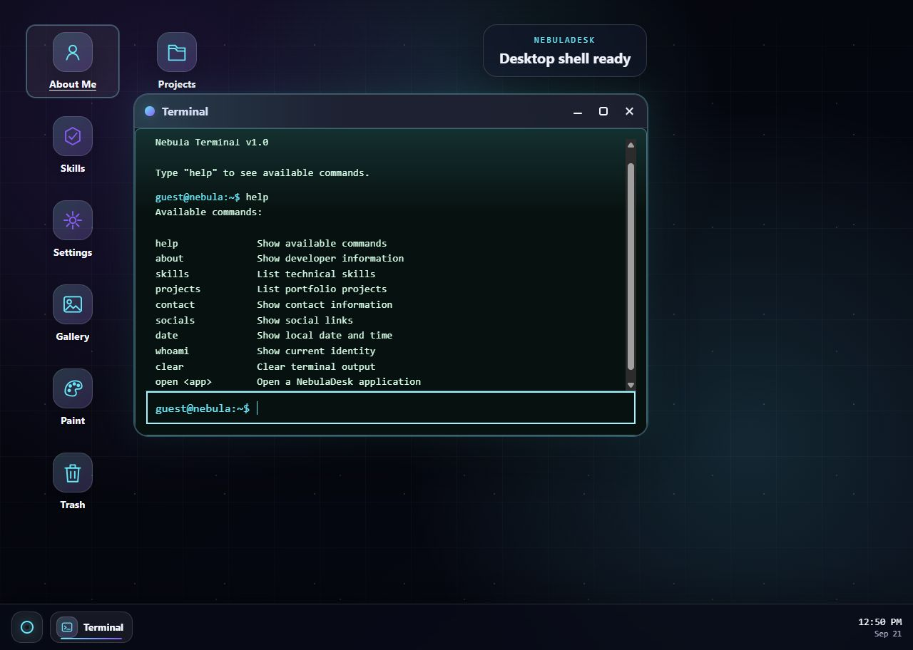
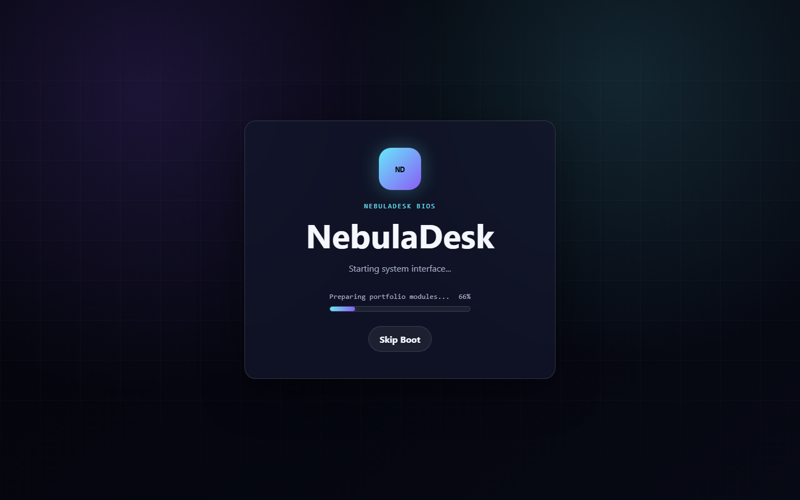
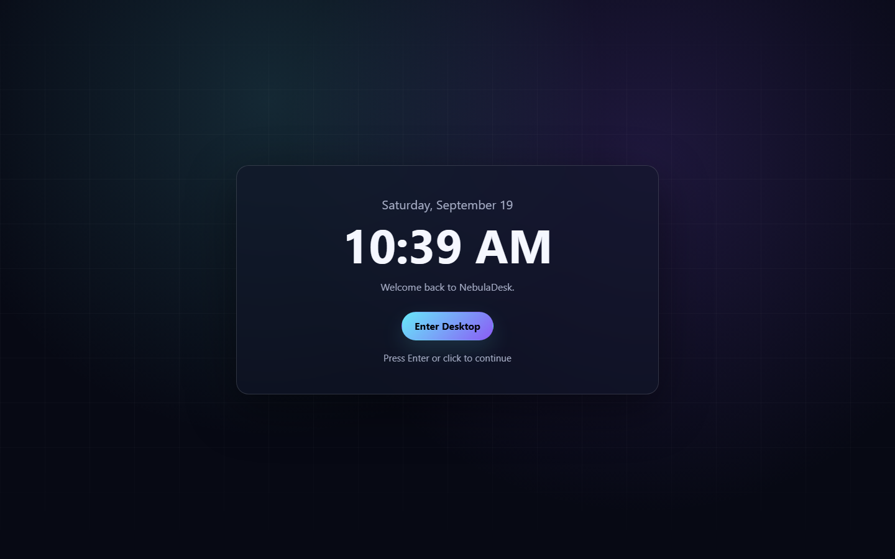

# NebulaDesk

**A frontend portfolio built as a desktop you can explore.**

NebulaDesk turns portfolio content into a browser-based operating system: open apps, manage windows, search the Start Menu, and move between projects, skills, and contact information. It runs entirely in the browser with React and Vite; no backend or account is required.



## Demo

A public demo has not been deployed yet. To try the current version locally, follow [Installation](#installation), then open the URL printed by Vite. The first visit shows a short boot sequence and a lock screen; select **Enter Desktop** to continue.

## Screenshots

The desktop image above was captured from the running app. These views show the other side of the system flow:

| Startup | Lock screen |
| --- | --- |
|  |  |

## Features

- **Desktop shell:** boot, lock, sleep, restart, shutdown, desktop icons, taskbar, and searchable Start Menu.
- **Window manager:** open, focus, move, minimize, restore, maximize, and close apps. On smaller screens, apps switch to a full-screen interaction model.
- **Portfolio apps:** About Me, Projects, Skills, Gallery, and a Terminal that reads from the same portfolio data.
- **Other apps:** Notes, Settings, Music Player, Paint, Memory Game, and Trash.
- **Personalization:** dark and light themes, accent colors, sound and animation preferences.
- **Persistence:** preferences, notes, music volume, and the Memory Game best score are stored in the browser. Open windows and focus state reset with a new desktop session.

Keyboard shortcuts: `Alt+1` opens About Me, `Alt+2` Projects, `Alt+3` Terminal, and `Alt+4` Settings. `Ctrl/Command+Space` toggles the Start Menu. The Terminal supports commands such as `help`, `about`, `projects`, `skills`, `contact`, and `open <app>`.

## Architecture

The desktop shell owns system state. The app registry provides the same app metadata to desktop icons, the Start Menu, taskbar, Terminal, and window renderer. Individual apps own their content and local interactions.

```text
SystemShell (boot, lock, sleep, power)
  -> Desktop (icons, Start Menu, taskbar)
    -> Window manager (open windows, stacking, bounds, focus)
      -> ApplicationRenderer -> apps

src/data/ (profile, projects, skills, socials, gallery)
  -> portfolio apps and Terminal

Storage utilities -> browser localStorage
```

The main boundaries are in `src/components/System/`, `src/components/Desktop/`, `src/components/Window/`, `src/apps/`, `src/data/`, and `src/utils/`. Keeping portfolio content in `src/data/` lets the interface reuse it without duplicating personal details across apps.

## Tech Stack

| Area | Tools |
| --- | --- |
| Interface | React 19, JavaScript, CSS |
| Build | Vite 8 |
| Browser features | localStorage, Canvas API, audio, Pointer Events |
| Quality checks | oxlint, Vitest, jsdom, React Testing Library, jest-dom |

## Testing

The current test setup is deliberately small. One Vitest test exercises the Notes storage utility: it saves notes, filters malformed or duplicate entries, and loads the result back from localStorage. jsdom and jest-dom are configured; React Testing Library is available for component tests as coverage grows. This is a starting point, not comprehensive test coverage.

```bash
npm run lint
npm run test:run
npm run build
```

Use `npm test` for Vitest watch mode while developing.

## Accessibility

The interface includes keyboard shortcuts, visible focus styles, named controls, selected-state announcements, and focus handling when windows and menus open or close. Motion styles respect `prefers-reduced-motion`, and mobile apps use touch-friendly full-screen layouts.

A complete keyboard and screen-reader audit is still planned; the current implementation should not be treated as a finished accessibility certification.

## Performance

Vite produces a static production build, and the app needs no server-side API to navigate portfolio content. Persistent data is kept locally, while transient window state is recreated for each desktop session.

No published performance score is claimed yet. Bundle size, image and audio loading, and behavior on lower-powered mobile devices are areas for a measured production audit before release.

## Installation

Use a Node.js version supported by the installed Vite release, then run:

```bash
npm install
npm run dev
```

| Command | Purpose |
| --- | --- |
| `npm run dev` | Start the local development server |
| `npm run lint` | Check the source with oxlint |
| `npm test` | Run Vitest in watch mode |
| `npm run test:run` | Run tests once |
| `npm run build` | Create the production build in `dist/` |
| `npm run preview` | Preview that build locally |

## Challenges

- **One window system, many apps.** Window focus, movement, and lifecycle are centralized so each app can concentrate on its own content.
- **Desktop and mobile behavior.** Floating windows work on desktop, while the same app content is presented full-screen on small screens.
- **Persistent versus temporary state.** Notes and preferences should survive a refresh; stale window positions and focus should not.
- **Keyboard interaction in layered UI.** Shortcuts, menus, windows, and dialogs need predictable focus behavior as users move between them.

## What I Learned

Building a desktop metaphor made state ownership more important than the number of apps. Shared app metadata and data files reduce drift between the desktop, Terminal, and portfolio views. Browser storage needs validation and fallbacks, and responsive design sometimes requires a different interaction model rather than a smaller desktop window.

The next useful work is deeper testing, accessibility review, and measured performance improvements. The feature set is already broad enough to demonstrate the idea.

## Personalize This Portfolio

Your public content lives mainly in `src/data/`:

| File | Update |
| --- | --- |
| [`profile.js`](src/data/profile.js) | Name, role, bio, location, email, experience, education, interests |
| [`socials.js`](src/data/socials.js) | Public profile labels and URLs |
| [`projects.js`](src/data/projects.js) | Project descriptions, technologies, links, screenshots, challenges |
| [`skills.js`](src/data/skills.js) | Skills, categories, and levels |
| [`gallery.js`](src/data/gallery.js) | Images, captions, categories, and alt text |

Put new images in `src/assets/` and import them from the relevant data file. Update [`index.html`](index.html) for the browser title and description, and [`favicon.svg`](src/assets/favicon.svg) for the icon. Review contact links and personal details before publishing.

## Roadmap and Scope

The next milestones focus on engineering quality:

- Expand meaningful unit and component tests around shared behavior and important user flows.
- Audit keyboard use, screen-reader behavior, and mobile layouts.
- Measure production performance and improve loading where the results justify it.
- Publish a live demo, add release screenshots, and choose a license.

Calculator, Weather, Calendar, a Chat app, and a long list of extra mini-apps are **intentionally out of scope**. NebulaDesk already has enough features; improving reliability, accessibility, maintainability, and performance will make the project stronger than adding ten more icons to the desktop.
